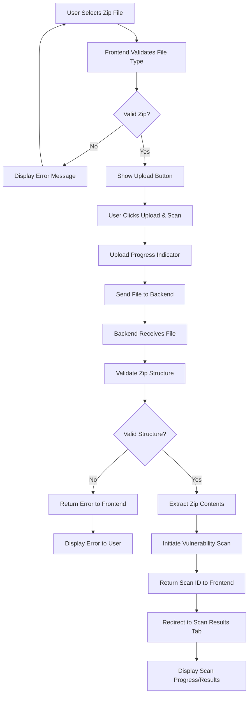
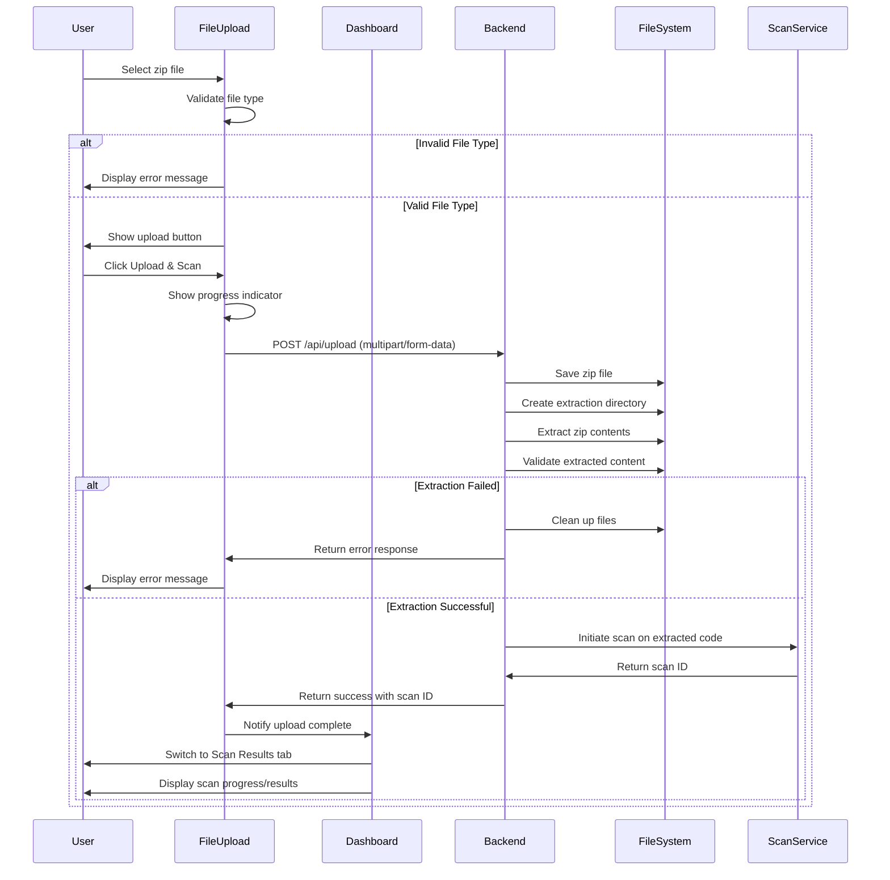
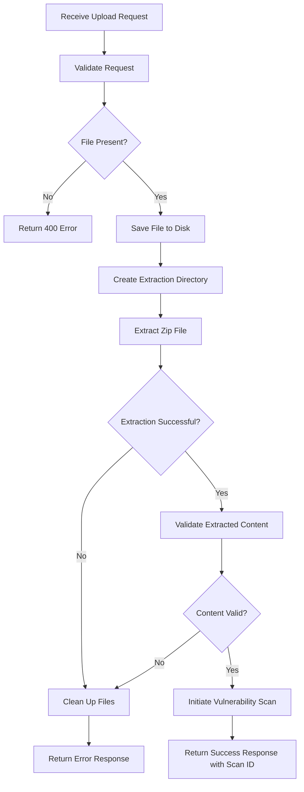

# File Upload Flow Documentation

This document describes the file upload flow for the Surakshit AI Security Vulnerability Dashboard, allowing users to upload their codebase as a zip file for vulnerability scanning.

## Overview

The file upload feature enables users to:
- Upload their codebase as a zip file
- Validate the zip file structure
- Extract the codebase for scanning
- Initiate a vulnerability scan on the extracted code
- View the scan results

## File Upload Flow Diagram

## Component Interaction

## Backend Processing Flow

## Error Handling

The file upload flow includes comprehensive error handling:

1. **Frontend Validation:**
   - Validates file type (must be .zip)
   - Checks file size (maximum 50MB)
   - Provides immediate feedback to the user

2. **Backend Validation:**
   - Verifies the file is a valid zip archive
   - Ensures the zip can be extracted properly
   - Validates the extracted content contains actual code files
   - Handles filesystem errors gracefully

3. **Error Responses:**
   - Clear error messages are returned to the frontend
   - User-friendly error messages are displayed
   - Temporary files are cleaned up on error

## Security Considerations

The file upload implementation includes several security measures:

1. **File Type Validation:**
   - Both frontend and backend validate the file is a zip
   - MIME type and file extension checks

2. **Size Limitations:**
   - Maximum file size enforced (50MB)
   - Prevents denial of service attacks

3. **Secure Storage:**
   - Files stored in a dedicated upload directory
   - Unique filenames generated using UUID
   - Extraction in isolated directories

4. **Content Validation:**
   - Extracted content is validated before processing
   - Malformed zip files are rejected

5. **Resource Cleanup:**
   - Temporary files are removed after processing
   - Failed uploads are cleaned up automatically