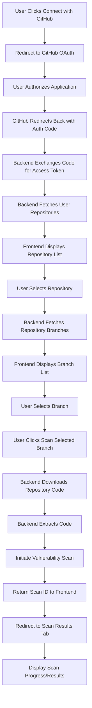
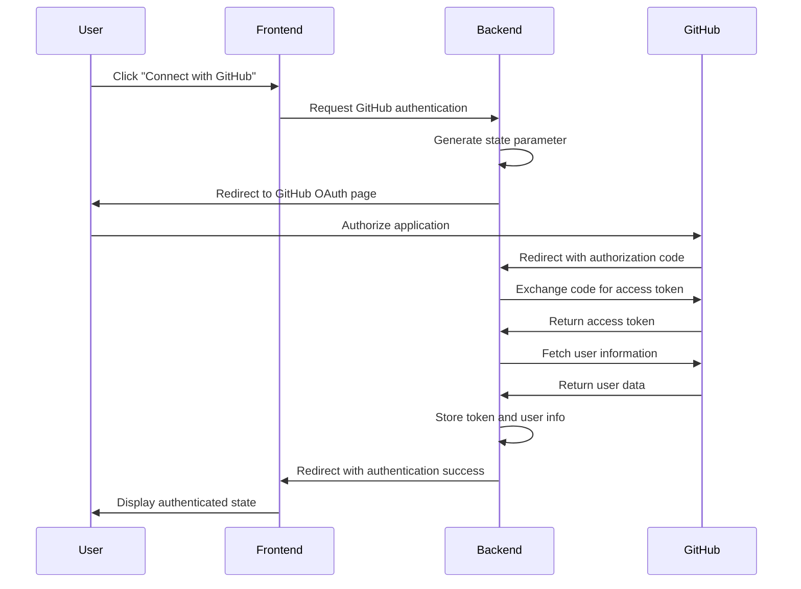
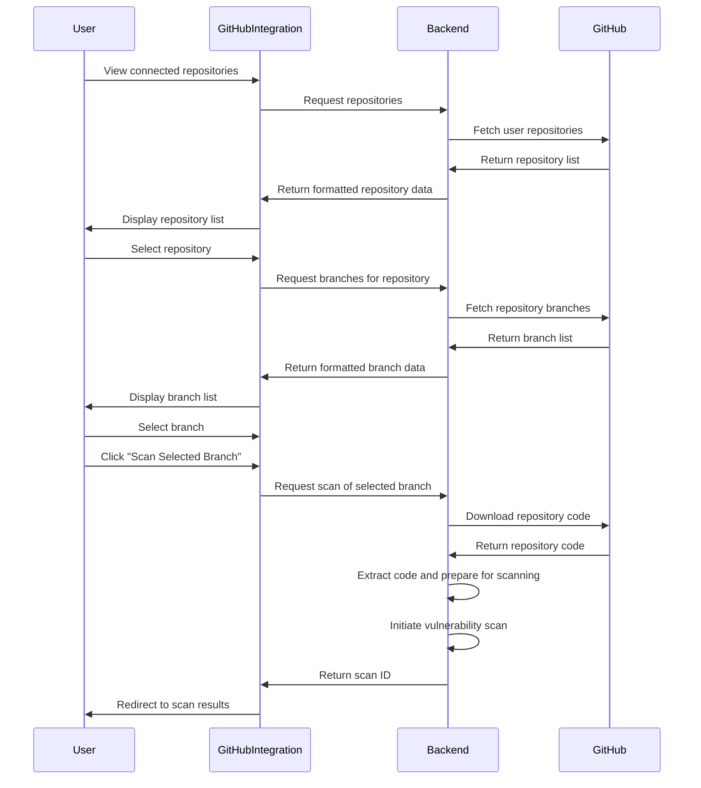
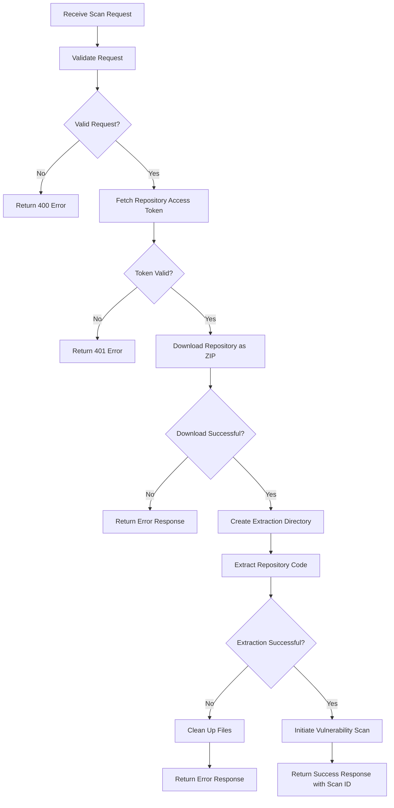

# GitHub Integration Flow Documentation

This document describes the GitHub integration flow for the Surakshit AI Security Vulnerability Dashboard, allowing users to connect their GitHub repositories for vulnerability scanning.

## Overview

The GitHub integration feature enables users to:
- Authenticate with GitHub using OAuth
- Select a repository from their GitHub account
- Choose a specific branch or commit for scanning
- Initiate a vulnerability scan on the selected code
- View the scan results

## GitHub Integration Flow Diagram

## OAuth Authentication Flow

## Repository Selection Flow

## Backend Processing Flow

## Error Handling

The GitHub integration flow includes comprehensive error handling:

1. **Authentication Errors:**
   - Invalid or expired OAuth tokens
   - Revoked application access
   - Failed GitHub API requests

2. **Repository Access Errors:**
   - Repository not found
   - Insufficient permissions
   - Private repository access issues

3. **Branch Selection Errors:**
   - Branch not found
   - Empty repositories
   - Invalid branch names

4. **Download and Extraction Errors:**
   - Network failures during download
   - Invalid zip format
   - Extraction failures
   - Insufficient disk space

5. **Error Responses:**
   - Clear error messages are returned to the frontend
   - User-friendly error messages are displayed
   - Appropriate HTTP status codes are used

## Security Considerations

The GitHub integration implementation includes several security measures:

1. **OAuth Security:**
   - State parameter to prevent CSRF attacks
   - Secure token storage
   - Minimal scope requests (only 'repo' access)

2. **Token Management:**
   - Tokens stored securely (not in client-side storage)
   - Token validation before each GitHub API request
   - Proper error handling for expired tokens

3. **Repository Access:**
   - Only repositories the user has access to are available
   - Repository code is downloaded securely via GitHub API
   - Downloaded code is isolated in separate directories

4. **Resource Cleanup:**
   - Temporary files are removed after processing
   - Failed downloads are cleaned up automatically