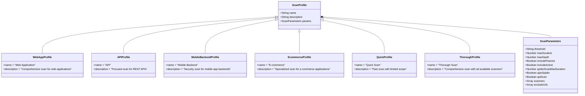

# Vulnerability Scanning Flow

This document outlines the vulnerability scanning flow implemented in the Surakshit AI system, which integrates with industry-standard scanning tools like OWASP ZAP.

## Scanning Process Overview

The scanning process involves several steps, from selecting a scan profile to processing and displaying the results.

## OWASP ZAP Integration Flow

The system integrates with OWASP ZAP for vulnerability scanning, following this process:

## Scan Profiles and Configuration

The system supports multiple scanning profiles for different project types, with configurable parameters:

## Vulnerability Processing Flow

Once vulnerabilities are detected, they are processed and standardized for further analysis:

## User Interface Flow

The user interface flow for vulnerability scanning:

## Conclusion

The vulnerability scanning flow in Surakshit AI provides a comprehensive approach to identifying security issues in applications. By integrating with industry-standard tools like OWASP ZAP and supporting multiple scanning profiles, the system offers flexibility and thoroughness in security assessments.