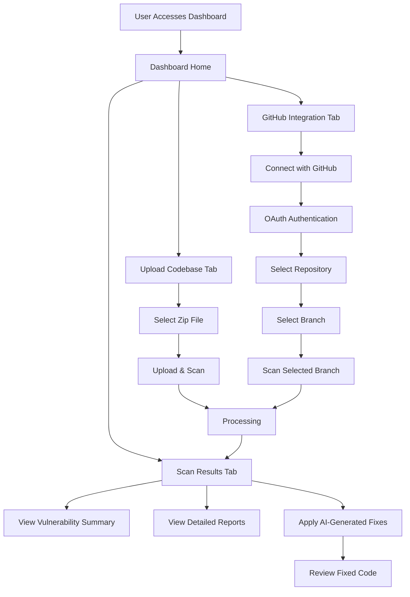
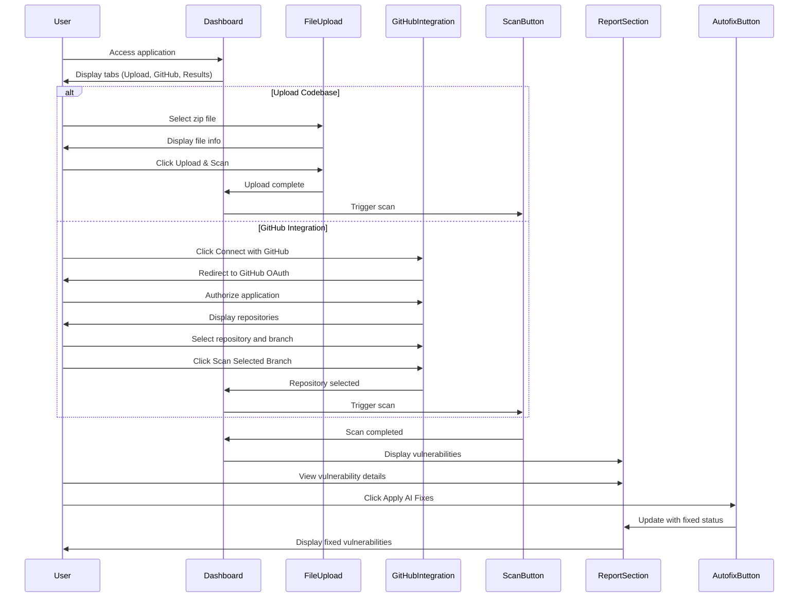
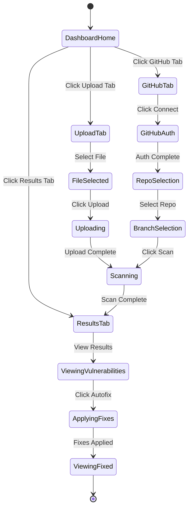

# UI Flow Documentation

This document describes the user interface flow for the Surakshit AI Security Vulnerability Dashboard.

## Dashboard Overview

The dashboard provides a clean and intuitive interface for users to:
- Upload codebases as zip files
- Connect GitHub repositories
- Initiate vulnerability scans
- View scan results
- Apply automated fixes for detected vulnerabilities

## UI Flow Diagram

## Component Interaction

## User Interaction States

## Mobile Responsive Behavior

The dashboard UI is designed to be responsive across different device sizes:

- On desktop: Tabs are displayed horizontally at the top of the page
- On mobile: Tabs stack vertically for easier touch interaction
- File upload and GitHub integration components adjust their layout for smaller screens
- Vulnerability reports collapse to a more compact view on mobile devices

## Accessibility Considerations

- Color contrast meets WCAG 2.1 AA standards
- All interactive elements are keyboard accessible
- Screen reader friendly with appropriate ARIA attributes
- Focus states are clearly visible for keyboard navigation